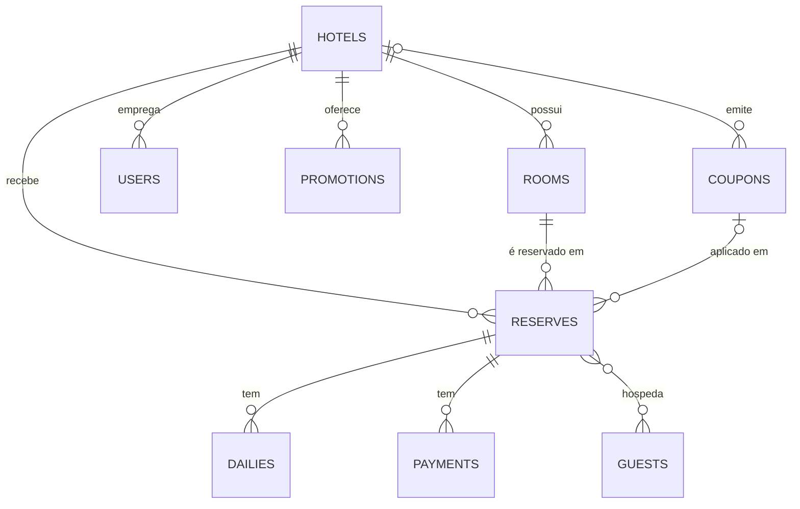

# Foco Hotel API

[](https://github.com/EduardoSL0/desafio-foco-hotel-api/actions/workflows/ci.yml)

API de gestão hoteleira feita em **Laravel 12** para o desafio da Foco. Ela importa hotéis, quartos e reservas
dos XMLs (de hora em hora, via cron), tem o CRUD de quartos e um motor de reservas com disponibilidade,
promoções, cupons, taxas e pagamentos. Todas as respostas são em JSON.

## Como rodar

Precisa só do Docker.

```bash
docker compose up -d --build
```

Na primeira vez leva 1 ou 2 minutos: instala as dependências, cria o banco, importa os XMLs e cria usuários de teste.
Depois abra **http://localhost:8080**: é a documentação interativa (Swagger), onde dá para testar tudo pelo navegador.

| Usuário | Senha | O que pode fazer |
|---|---|---|
| `admin@foco.test` | `password` | tudo, em todos os hotéis |
| `gerente@foco.test` | `password` | quartos, promoções, cupons, recepcionistas, estornos e relatório do Hotel Foco Prime |
| `recepcao@foco.test` | `password` | ver reservas e registrar pagamentos do Hotel Foco Prime |

Na página, é só clicar em **Entrar** ao lado de um usuário: o token é aplicado sozinho nas rotas protegidas.
Para testar o "minha reserva", já existe uma reserva de exemplo: localizador `FH7K3Q9X`, sobrenome `de Tal`.

Outros comandos úteis:

```bash
docker compose exec app php artisan test        # testes
docker compose exec app php artisan import:xml  # importar os XMLs na hora
docker compose exec app php artisan migrate:fresh --seed  # recomeçar o banco do zero
```

<details>
<summary>Rodar sem Docker</summary>

Com PHP 8.2+, Composer e MySQL 8:

```bash
composer install
cp .env.example .env      # ajuste os dados do banco
php artisan key:generate
php artisan migrate --seed
php artisan serve         # http://localhost:8000
php artisan schedule:work # em outro terminal: é o cron
```

</details>

## Importação dos XMLs e o cron

Os arquivos ficam em `database/xml` (`hotels.xml`, `rooms.xml`, `reserves.xml`). O comando é:

```bash
php artisan import:xml
```

- Ele valida os três arquivos antes de gravar e grava tudo numa transação: se algo grave falhar, nada muda no banco.
- Pode rodar quantas vezes quiser sem duplicar nada. O `id` de cada registro do XML fica guardado em `external_code`
  e é usado para atualizar o que já existe.
- O agendamento está em `routes/console.php` (de hora em hora). No Docker, o container `scheduler` faz o papel do
  cron. Ele também cancela as pré-reservas vencidas (`reserves:expire`, a cada 5 min) e limpa tokens expirados
  (uma vez por dia). Num servidor Linux bastaria esta linha no crontab:

```cron
* * * * * cd /caminho/do/projeto && php artisan schedule:run >> /dev/null 2>&1
```

Para mudar a frequência, altere `XML_IMPORT_CRON` no `.env` (ex.: `*/15 * * * *`).

## Modelagem do banco

As tabelas são criadas pelas migrations em `database/migrations`. O mesmo modelo está em
[`database/model/schema.sql`](database/model/schema.sql), que abre no **MySQL Workbench** como diagrama
(*File → Import → Reverse Engineer MySQL Create Script*).



Do XML para o banco: `Hotel` → `hotels`, `Room` → `rooms`, `Reserve` → `reserves`, `Guests/Guest` → `guests`
(ligado à reserva), `Dailies/Daily` → `dailies` e `Payments/Payment` → `payments`.

## Como cadastrar um quarto

Com o token de um admin ou gerente:

```bash
curl -X POST http://localhost:8080/api/v1/rooms \
  -H "Authorization: Bearer $TOKEN" -H "Content-Type: application/json" \
  -d '{"hotel_id": 1, "name": "Standard Casal", "capacity": 2, "inventory": 10, "daily_price": 189.90}'
```

`inventory` é quantas unidades iguais existem desse quarto (o "Standard tem 10 disponibilidades" do desafio).
Para editar: `PATCH /rooms/{id}`. Para remover: `DELETE /rooms/{id}` (não deixa se houver reservas futuras).

## Como criar uma reserva

Essa rota é pública, como num site de hotel:

```bash
curl -X POST http://localhost:8080/api/v1/reserves \
  -H "Content-Type: application/json" \
  -d '{"room_id": 1, "check_in": "2027-03-10", "check_out": "2027-03-13", "coupon_code": "BEMVINDO10",
       "guests": [{"name": "Maria", "last_name": "Souza", "phone": "5571999990000"}]}'
```

A resposta traz o localizador (`code`), as diárias e os valores. O cliente não envia o total: quem calcula é o
servidor, senão daria para pagar R$ 1 numa suíte. Para só simular o preço, use `POST /reserves/quote`.
As datas precisam ser futuras e no máximo 2 anos à frente.

Feita pelo site (sem login), a reserva é uma **pré-reserva**: fica `pending` e segura o quarto por 24 h
(`RESERVE_PENDING_TTL_HOURS`). Se ninguém registrar um pagamento até lá, o quarto é liberado e a reserva é
cancelada sozinha. Isso evita que alguém bloqueie todos os quartos com reservas que nunca serão pagas. Reservas
feitas pela equipe do hotel não expiram.

## Rotas

| Método | Rota | Login | Para quê |
|---|---|:---:|---|
| POST | `/auth/login` · `/auth/logout` · GET `/auth/me` | | entrar, sair, ver quem sou |
| GET | `/hotels` · `/hotels/{id}` | | hotéis |
| GET · POST · PATCH · DELETE | `/rooms` · `/rooms/{id}` | POST, PATCH e DELETE | CRUD de quartos |
| GET | `/rooms/{id}/availability` | | unidades livres no período |
| GET | `/availability` | | busca de quartos livres já com o preço |
| POST | `/reserves/quote` · `/reserves` | | cotar e criar reserva |
| POST | `/reserves/lookup` | | "minha reserva" (localizador + sobrenome) |
| GET · PATCH | `/reserves` · `/reserves/{id}` · `/reserves/{id}/cancel` | 🔒 | consultar e cancelar |
| GET · POST | `/reserves/{id}/payments` | 🔒 | pagamentos |
| POST | `/reserves/{id}/payments/{pagamento}/refund` | 🔒 | estorno (admin e gerente) |
| GET · POST · DELETE | `/coupons` | 🔒 | cupons |
| CRUD | `/promotions` · `/users` | 🔒 | promoções e equipe do hotel |
| GET | `/hotels/{id}/report` | 🔒 | ocupação, diária média e RevPAR |

Base: `http://localhost:8080/api/v1`. Os detalhes de cada rota estão no Swagger.

## Regras de negócio

- **Disponibilidade:** cada quarto tem um número de unidades (`inventory`). A ocupação é conferida noite a noite e
  o dia do check-out não conta. Na hora de gravar, o quarto fica travado no banco para duas pessoas não reservarem
  a última unidade ao mesmo tempo.
- **Preço, nesta ordem:** diárias → promoção (a maior do dia) → cupom → taxa de serviço do hotel.
  Ex.: 3 × R$ 100 com promoção de 20%, cupom de 10% e taxa de 10% = **R$ 237,60**.
- **Pagamentos:** 1 crédito, 2 débito, 3 pix, 4 dinheiro, 5 boleto. No crédito dá para parcelar em até 12×;
  acima de 3× entram juros simples de 1,99% por parcela a mais. Os juros são cobrados no cartão: ficam registrados
  no pagamento, mas não mudam o total da reserva. Não dá para pagar acima do saldo. O status vai de
  `pending` → `partially_paid` → `paid`.
- **Estorno:** admin ou gerente estorna um pagamento inteiro; ele deixa de contar no saldo e o status é recalculado.
  É assim que se devolve o dinheiro de uma reserva cancelada. Pagamentos vindos do XML são estornados na origem.
- **Cupons:** a validade é conferida na data da compra. Um cupom já usado não é apagado, só desativado, para a
  reserva continuar mostrando qual cupom usou.
- **Permissões:** admin vê tudo; gerente e recepção só o próprio hotel. O gerente cuida dos recepcionistas e do
  próprio cadastro; criar ou promover gerentes é só com o admin. O último admin não pode ser rebaixado, e para
  trocar a própria senha é preciso informar a atual. As regras ficam em `app/Policies`.
- **Relatório:** a receita é o valor das diárias já com os descontos (o cupom é dividido entre as noites), então
  bate com o total das reservas. Dinheiro recebido de reserva cancelada continua no relatório até ser estornado.
- As contas de dinheiro são feitas em centavos, para não ter erro de arredondamento.

## Como o código está organizado

```
app/
├── Console/Commands/   # import:xml e reserves:expire (o que o cron roda), guests:anonymize
├── Http/Controllers/   # recebem o pedido e chamam os services
├── Http/Requests/      # validação de cada rota
├── Http/Resources/     # formato do JSON de resposta
├── Models/             # uma classe por tabela
├── Policies/           # quem pode fazer o quê
└── Services/           # as regras: reserva, pagamento, disponibilidade,
    ├── Import/         #   importação do XML (um importador por arquivo)
    └── Pricing/        #   cálculo do preço (uma classe por regra)
```

Separei as regras dos controllers (services) e fiz cada regra de preço e cada importador como uma classe
própria. Para criar uma nova taxa, por exemplo, basta uma classe nova em `Services/Pricing/Rules`.

## Testes, logs e Git

- **173 testes** com PHPUnit (`tests/`). Usam um banco em memória, então não mexem nos seus dados.
  Rodam também no GitHub Actions a cada push, junto com o padrão de código (Pint) e a validação do Swagger.
- **Logs** em `storage/logs`: `api-*.log` (cada acesso), `import-*.log` (cada importação) e `laravel-*.log`
  (eventos e erros). Toda resposta traz um `X-Request-Id`, que aparece em todas as linhas de log daquela requisição.
- **Commits** no padrão Conventional Commits (`feat:`, `fix:`, `docs:`, `test:`).

## Decisões sobre os XMLs

- **Reserva 6:** tem uma diária em 03/12, fora do período 01/10 a 04/10. Essa diária é ignorada (com aviso no log),
  senão ela contaria como ocupação e receita de dezembro, mês em que o hóspede não estava no hotel. Diárias com a
  mesma data repetida também são ignoradas.
- **Total diferente da soma das diárias:** a diferença vira desconto (dividido entre as noites) ou taxa.
- **`rooms.xml` não tem preço:** a diária do quarto vem da última diária importada dele.
- **Quarto já cadastrado:** a importação não troca o nome nem o hotel de um quarto que já existe (o hoteleiro pode
  ter editado pela API). Se o XML trouxer um quarto em outro hotel, aparece um aviso.
- **Overbooking no XML:** o XML é a fonte da verdade do canal de vendas, então a reserva é gravada, mas um aviso
  avisa quando o quarto ficou com mais reservas do que unidades.
- **Formas de pagamento:** o XML só traz o número (`<Method>1</Method>`), então defini 1 crédito, 2 débito, 3 pix,
  4 dinheiro e 5 boleto.
- **Mesmo hóspede em duas reservas** (mesmo nome e telefone): vira um hóspede só, ligado às duas.
- **Reserva 1:** total de R$ 300 com R$ 100 pago, então fica como `partially_paid`.

## Segurança

Login por token com validade de 8 h, permissões por perfil e por hotel, limite de requisições (inclusive contra
força bruta no login), validação de tudo que entra, proteção contra XXE na leitura do XML e respostas de erro
sem detalhes internos: qualquer erro inesperado vira uma mensagem genérica com o `X-Request-Id`, mesmo com
`APP_DEBUG=true`, e banco fora do ar responde 503.

- **Dados dos hóspedes:** "minha reserva" e a reserva feita sem login devolvem só nomes, datas e valores, nunca
  telefone, e-mail ou a lista de pagamentos. Um e-mail já cadastrado nunca é sobrescrito por uma reserva pública.
- **LGPD:** `php artisan guests:anonymize {id}` apaga nome, telefone e e-mail de um hóspede a pedido dele; as
  reservas continuam existindo (o hotel precisa delas para fins fiscais), mas sem identificar a pessoa.
- **Login:** o tempo de resposta é o mesmo para e-mail existente ou não; e-mails são gravados em minúsculas.
- **Auditoria:** cancelamentos, pagamentos, estornos, cupons, mudanças de preço/inventário (com valor antigo e
  novo) e mudanças de perfil ficam no log com o usuário que fez.

### Antes de colocar em produção

O `docker-compose.yml` é para avaliação. Em outro ambiente:

- defina `DB_PASSWORD`, `MYSQL_ROOT_PASSWORD` e `SEED_ON_START=false` (o primeiro admin é criado com
  `php artisan user:create-admin email@hotel.com`). O MySQL só aceita conexões desta máquina (porta 3307).
- atrás de um balanceador, informe os IPs dele em `TRUSTED_PROXIES`, senão os limites "por IP" valem para todos
  os clientes juntos; e restrinja `CORS_ALLOWED_ORIGINS` aos domínios do site.
- comandos destrutivos (`migrate:fresh`, `db:wipe`) ficam bloqueados com `APP_ENV=production`.
- **backup** do banco: `docker compose exec mysql sh -c 'mysqldump -uroot -p"$MYSQL_ROOT_PASSWORD" foco_hotel' > backup.sql`
  (agende num cron do servidor e guarde fora da máquina). Para restaurar:
  `docker compose exec -T mysql sh -c 'mysql -uroot -p"$MYSQL_ROOT_PASSWORD" foco_hotel' < backup.sql`.
