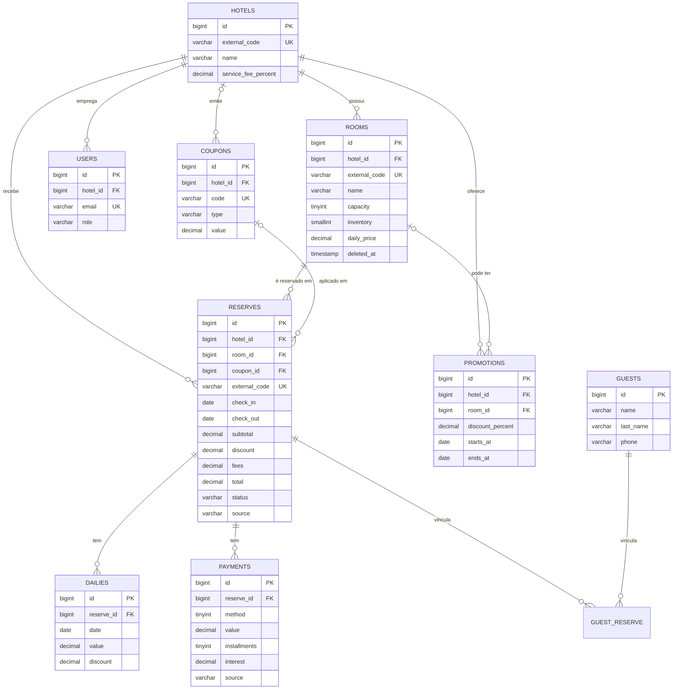

# Foco Hotel API — Desafio Foco Multimídia

API REST em **Laravel 11 (PHP 8.2+)** para gestão hoteleira:

- importação de **hotéis, quartos e reservas a partir de XML**, executada via **CRON**;
- **CRUD de quartos/acomodações**;
- **motor de reservas** (`POST /reserves`) com disponibilidade por inventário, promoções, cupons, taxa de serviço e pagamentos com juros de parcelamento;
- gestão do hoteleiro com **usuários e permissões** por hotel;
- documentação **OpenAPI 3.0 / Swagger**, **testes PHPUnit**, **Docker** e **logs de aplicação**.

> Todas as respostas da API são em **JSON**.

---

## Sumário

1. [Stack](#1-stack)
2. [Como executar (Docker)](#2-como-executar-docker)
3. [Como executar (sem Docker)](#3-como-executar-sem-docker)
4. [Importação de XML e CRON](#4-importação-de-xml-e-cron)
5. [Modelagem do banco de dados](#5-modelagem-do-banco-de-dados)
6. [Autenticação e permissões](#6-autenticação-e-permissões)
7. [Endpoints e exemplos](#7-endpoints-e-exemplos) — inclui **como cadastrar um quarto** e **como criar uma reserva**
8. [Regras de negócio](#8-regras-de-negócio)
9. [Arquitetura e padrões de projeto](#9-arquitetura-e-padrões-de-projeto)
10. [Testes automatizados](#10-testes-automatizados)
11. [Logs](#11-logs)
12. [Segurança](#12-segurança)
13. [Padrão de Git](#13-padrão-de-git)
14. [Decisões e inconsistências encontradas nos XMLs](#14-decisões-e-inconsistências-encontradas-nos-xmls)

---

## 1. Stack

| Camada        | Tecnologia                                   |
|---------------|----------------------------------------------|
| Linguagem     | PHP 8.3 (compatível com 8.2+)                |
| Framework     | Laravel 11                                   |
| Autenticação  | Laravel Sanctum (Bearer token)               |
| Banco         | MySQL 8 (testes usam SQLite em memória)      |
| Servidor      | Nginx + PHP-FPM                              |
| Documentação  | OpenAPI 3.0.0 + Swagger UI                   |
| Testes        | PHPUnit 11                                   |
| Infra         | Docker / Docker Compose                      |

---

## 2. Como executar (Docker)

Pré-requisito: Docker Desktop (ou Docker Engine + Compose v2).

```bash
docker compose up -d --build
```

Na primeira subida o container `app` automaticamente:

1. copia `.env.example` para `.env` e gera a `APP_KEY`;
2. roda `composer install`;
3. roda as migrations (`php artisan migrate`);
4. roda o seed, que **importa os XMLs** de `database/xml` e cria usuários/cupom/promoção de exemplo.

Acompanhe com `docker compose logs -f app`. Quando terminar:

| Recurso                  | URL                                   |
|--------------------------|---------------------------------------|
| API                      | http://localhost:8080/api/v1          |
| Swagger UI               | http://localhost:8080/docs/           |
| Especificação OpenAPI    | http://localhost:8080/docs/openapi.yaml |
| Health check             | http://localhost:8080/up              |
| MySQL (host)             | `localhost:3307` (foco / secret)      |

Serviços do `docker-compose.yml`:

| Serviço     | Função                                                                 |
|-------------|------------------------------------------------------------------------|
| `app`       | PHP-FPM com a aplicação                                                |
| `nginx`     | Servidor web (porta 8080)                                              |
| `mysql`     | Banco de dados MySQL 8                                                 |
| `scheduler` | Roda `php artisan schedule:work` — é o **CRON** que dispara a importação |

Comandos úteis:

```bash
docker compose exec app php artisan import:xml      # importação manual
docker compose exec app php artisan test            # testes
docker compose exec app php artisan migrate:fresh --seed   # recria o banco
docker compose exec app php artisan route:list --path=api  # lista as rotas
```

---

## 3. Como executar (sem Docker)

Pré-requisitos: PHP 8.2+ (extensões `pdo_mysql`, `pdo_sqlite`, `simplexml`, `mbstring`), Composer e MySQL 8.

```bash
composer install
cp .env.example .env            # ajuste DB_HOST=127.0.0.1 e as credenciais
php artisan key:generate
php artisan migrate --seed
php artisan serve               # http://localhost:8000
```

---

## 4. Importação de XML e CRON

### Comando

```bash
php artisan import:xml                       # usa database/xml (padrão)
php artisan import:xml --path=/outro/diretorio
```

O diretório deve conter `hotels.xml`, `rooms.xml` e `reserves.xml`. Saída de exemplo:

```
+----------+---------+-------------+-------------+-----------+
| Entidade | Criados | Atualizados | Inalterados | Ignorados |
+----------+---------+-------------+-------------+-----------+
| hotels   | 3       | 0           | 0           | 0         |
| rooms    | 6       | 0           | 0           | 0         |
| reserves | 6       | 0           | 0           | 0         |
+----------+---------+-------------+-------------+-----------+
  ! Reserva 6: diária 2022-12-03 fora do período 2022-10-01 a 2022-10-04.
```

### Como funciona

1. **Carrega e valida os 3 arquivos antes de tocar no banco** (arquivo ausente ou XML malformado ⇒ falha sem alterar nada).
2. Importa na ordem **hotéis → quartos → reservas** dentro de **uma única transação** (tudo ou nada).
3. É **idempotente**: os `id` do XML são gravados em `external_code`, e cada execução faz *upsert* por esse código. Rodar 1 ou 100 vezes produz o mesmo resultado.
4. Hóspedes são deduplicados por nome + sobrenome + telefone.
5. Diárias e pagamentos vindos do XML são substituídos a cada execução; **pagamentos registrados pela API são preservados**.
6. O status financeiro da reserva é recalculado (`pending`, `partially_paid`, `paid`).
7. Inconsistências viram avisos no console e em `storage/logs/import-*.log`.

### Agendamento (CRON)

O agendamento está em [`routes/console.php`](routes/console.php):

```php
Schedule::command('import:xml')
    ->cron(config('hotel.import.schedule'))   // XML_IMPORT_CRON, padrão "0 * * * *" (de hora em hora)
    ->withoutOverlapping();
```

**No Docker** o serviço `scheduler` já executa o agendador; nada a fazer.

**Em um servidor Linux**, adicione uma única linha ao crontab (`crontab -e`):

```cron
* * * * * cd /caminho/do/projeto && php artisan schedule:run >> /dev/null 2>&1
```

Para mudar a frequência, altere `XML_IMPORT_CRON` no `.env` (ex.: `*/15 * * * *` para a cada 15 minutos).
Para conferir: `php artisan schedule:list`.

---

## 5. Modelagem do banco de dados

- Migrations versionadas em [`database/migrations`](database/migrations).
- Script DDL MySQL em [`database/model/schema.sql`](database/model/schema.sql) — no **MySQL Workbench** use
  *File → Import → Reverse Engineer MySQL Create Script* para gerar o diagrama EER.



### Mapeamento XML → banco

| XML                                   | Tabela / coluna                                  |
|---------------------------------------|--------------------------------------------------|
| `Hotel@id`, `Name`                    | `hotels.external_code`, `hotels.name`            |
| `Room@id`, `Room@hotelCode`, `Name`   | `rooms.external_code`, `rooms.hotel_id`, `rooms.name` |
| `Reserve@id/@hotelCode/@roomCode`     | `reserves.external_code`, `hotel_id`, `room_id`  |
| `CheckIn`, `CheckOut`, `Total`        | `reserves.check_in`, `check_out`, `total`        |
| `Guests/Guest`                        | `guests` + pivô `guest_reserve` (N:N)            |
| `Dailies/Daily` (`Date`, `Value`)     | `dailies.date`, `dailies.value`                  |
| `Payments/Payment` (`Method`, `Value`)| `payments.method`, `payments.value`              |

Por que `external_code` em vez de reaproveitar o `id` do XML? Porque quartos/reservas também são criados pela API. Mantendo IDs internos auto-incrementais e o código de origem separado, um novo registro vindo do XML nunca sobrescreve um registro criado pela API.

---

## 6. Autenticação e permissões

```bash
curl -X POST http://localhost:8080/api/v1/auth/login \
  -H "Content-Type: application/json" \
  -d '{"email":"admin@foco.test","password":"password"}'
```

Use o `access_token` retornado em `Authorization: Bearer <token>`. O token expira em 8h (`API_TOKEN_TTL_HOURS`).

**Usuários criados pelo seed (somente ambiente local):**

| E-mail               | Senha      | Perfil         | Hotel            |
|----------------------|------------|----------------|------------------|
| admin@foco.test      | password   | `admin`        | todos            |
| gerente@foco.test    | password   | `manager`      | Hotel Foco Prime |
| recepcao@foco.test   | password   | `receptionist` | Hotel Foco Prime |

| Ação                                  | admin | manager (próprio hotel) | receptionist (próprio hotel) | público |
|---------------------------------------|:-----:|:-----------------------:|:----------------------------:|:-------:|
| Listar/ver hotéis e quartos           | ✅    | ✅                      | ✅                           | ✅      |
| Cotar e criar reserva                 | ✅    | ✅                      | ✅                           | ✅      |
| Criar/editar/remover quarto           | ✅    | ✅                      | ❌                           | ❌      |
| Listar/ver reservas                   | ✅    | ✅                      | ✅                           | ❌      |
| Cancelar reserva                      | ✅    | ✅                      | ❌                           | ❌      |
| Registrar pagamento                   | ✅    | ✅                      | ✅                           | ❌      |
| Criar cupom do hotel / cupom global   | ✅ / ✅ | ✅ / ❌               | ❌                           | ❌      |

As regras ficam em `app/Policies` e nos métodos `worksAt()` / `canManageHotel()` do model `User`.

---

## 7. Endpoints e exemplos

Base: `http://localhost:8080/api/v1` — documentação interativa em **http://localhost:8080/docs/**.

| Método      | Rota                               | Auth | Descrição                               |
|-------------|------------------------------------|:----:|-----------------------------------------|
| POST        | `/auth/login`                      |      | Gera token                              |
| GET         | `/auth/me`                         | 🔒   | Usuário logado                          |
| POST        | `/auth/logout`                     | 🔒   | Revoga token                            |
| GET         | `/hotels` · `/hotels/{id}`         |      | Hotéis                                  |
| GET         | `/rooms`                           |      | Lista quartos (`hotel_id`, `search`, `per_page`) |
| GET         | `/rooms/{id}`                      |      | Detalha quarto                          |
| GET         | `/rooms/{id}/availability`         |      | Unidades livres no período              |
| POST        | `/rooms`                           | 🔒   | **Cadastra quarto**                     |
| PUT/PATCH   | `/rooms/{id}`                      | 🔒   | Atualiza quarto                         |
| DELETE      | `/rooms/{id}`                      | 🔒   | Remove quarto (soft delete)             |
| POST        | `/reserves/quote`                  |      | Cotação sem criar reserva               |
| POST        | `/reserves`                        |      | **Cria reserva**                        |
| GET         | `/reserves` · `/reserves/{id}`     | 🔒   | Consulta reservas                       |
| PATCH       | `/reserves/{id}/cancel`            | 🔒   | Cancela reserva                         |
| GET / POST  | `/reserves/{id}/payments`          | 🔒   | Lista / registra pagamentos             |
| GET / POST  | `/coupons` · DELETE `/coupons/{id}`| 🔒   | Cupons                                  |

### Como cadastrar um quarto

```bash
curl -X POST http://localhost:8080/api/v1/rooms \
  -H "Authorization: Bearer $TOKEN" \
  -H "Content-Type: application/json" \
  -d '{
        "hotel_id": 1,
        "name": "Standard Casal",
        "description": "Cama de casal, ar-condicionado e varanda",
        "capacity": 2,
        "inventory": 10,
        "daily_price": 189.90
      }'
```

- `capacity`: máximo de hóspedes por unidade (padrão 2).
- `inventory`: quantas unidades desta acomodação existem (ex.: "Standard tem 10 disponibilidades"; padrão 1).
- `daily_price`: tarifa base da diária; sem ela o quarto não pode ser reservado.

Resposta `201`:

```json
{
  "data": {
    "id": 7, "hotel_id": 1, "name": "Standard Casal", "capacity": 2,
    "inventory": 10, "daily_price": 189.9, "hotel": { "id": 1, "name": "Hotel Foco Prime", "...": "..." }
  }
}
```

Atualizar: `PATCH /rooms/7` com `{"daily_price": 210}` · Remover: `DELETE /rooms/7` (retorna `409` se houver reservas futuras).

### Como criar uma reserva

```bash
curl -X POST http://localhost:8080/api/v1/reserves \
  -H "Content-Type: application/json" \
  -d '{
        "room_id": 1,
        "check_in": "2030-12-01",
        "check_out": "2030-12-04",
        "coupon_code": "BEMVINDO10",
        "guests": [
        { "name": "Maria", "last_name": "Souza", "phone": "5571999990000", "email": "maria@example.com"
    }
        ],
        "payments": [
        { "method": 1, "value": 100.00, "installments": 2
    }
        ]
      }'
```

Resposta `201` (resumida):

```json
{
  "data": {
    "id": 7, "status": "partially_paid", "check_in": "2030-12-01", "check_out": "2030-12-04", "nights": 3,
    "coupon_code": "BEMVINDO10",
    "amounts": { "subtotal": 300.0, "discount": 30.0, "fees": 0.0, "total": 270.0, "paid": 100.0, "balance": 170.0 },
    "dailies": [ { "date": "2030-12-01", "value": 100.0, "discount": 0.0 }, "..." ],
    "guests": [ { "id": 6, "name": "Maria", "last_name": "Souza", "phone": "5571999990000" } ],
    "payments": [ { "method": 1, "method_label": "Cartão de crédito", "value": 100.0, "installments": 2, "interest": 0.0 } ]
  }
}
```

Para apenas simular o preço use `POST /reserves/quote` com os mesmos campos (sem `guests`).

Códigos de resposta: `201` criado · `401` sem token · `403` sem permissão · `404` não encontrado · `409` sem disponibilidade / conflito · `422` validação · `429` limite de requisições.

---

## 8. Regras de negócio

### Disponibilidade
- Cada quarto tem um `inventory` (unidades). A ocupação é calculada **noite a noite**; o período só é aceito se em **todas** as noites houver ao menos uma unidade livre.
- O dia de check-out não ocupa o quarto (reservas "encostadas" são permitidas).
- Reservas `cancelled` não ocupam inventário.
- A criação usa `SELECT ... FOR UPDATE` no quarto dentro de uma transação, evitando *overbooking* em requisições concorrentes.

### Preço (aplicado nesta ordem)
1. **Diárias**: `daily_price` do quarto × noites.
2. **Promoções** (`promotions`): percentual por período, para o hotel inteiro ou um quarto; em cada noite vale a maior promoção vigente (não cumulativas).
3. **Cupom** (`coupons`): percentual ou valor fixo, sobre o valor já com promoções; valida ativo, hotel, vigência e limite de usos.
4. **Taxa de serviço** (`hotels.service_fee_percent`): acréscimo percentual sobre o valor com descontos.

Exemplo: 3 noites × R$ 100 com promoção 20%, cupom 10% e taxa 10% ⇒ 300 − 60 = 240 → −24 = 216 → +21,60 = **R$ 237,60**.

### Pagamentos
- Métodos: `1` crédito, `2` débito, `3` pix, `4` dinheiro, `5` boleto.
- Não é permitido pagar acima do saldo devedor nem pagar reserva cancelada.
- Parcelamento apenas no crédito, até 12x. Acima de **3x** incidem **juros simples de 1,99% por parcela excedente** (`PAYMENT_INTEREST_FREE_INSTALLMENTS`, `PAYMENT_MONTHLY_INTEREST_PERCENT`). Os juros ficam em `payments.interest` e não reduzem o saldo da reserva.
- Status da reserva: `pending` → `partially_paid` → `paid` (recalculado a cada pagamento); `cancelled` via endpoint de cancelamento.

Todos os cálculos monetários são feitos em **centavos (inteiros)** para evitar erros de ponto flutuante (`App\Support\Money`).

---

## 9. Arquitetura e padrões de projeto

```
app/
├── Console/Commands/ImportXmlCommand.php   # comando executado pelo CRON
├── Enums/                                   # UserRole, ReserveStatus, PaymentMethod, DiscountType
├── Exceptions/                              # exceções de negócio que se renderizam como JSON
├── Http/
│   ├── Controllers/Api/                     # controllers finos
│   ├── Middleware/                          # ForceJsonResponse, LogApiRequest
│   ├── Requests/                            # validação (Form Requests)
│   └── Resources/                           # formato das respostas JSON (API Resources)
├── Models/
├── Policies/                                # autorização por perfil/hotel
├── Services/
│   ├── Import/                              # orquestrador + importadores por entidade
│   ├── Pricing/                             # calculadora + regras de preço
│   ├── AvailabilityService.php
│   ├── PaymentService.php
│   └── ReserveService.php
└── Support/Money.php
```

| Padrão                         | Onde                                                                 |
|--------------------------------|----------------------------------------------------------------------|
| **Service Layer**              | `ReserveService`, `PaymentService`, `AvailabilityService`, `XmlImportService` — regras fora dos controllers |
| **Strategy**                   | `PriceRule` (Promotion/Coupon/ServiceFee) e `XmlEntityImporter` (Hotel/Room/Reserve) |
| **Chain / Pipeline**           | `PriceCalculator` aplica as regras em sequência sobre um `PriceBreakdown` |
| **Dependency Injection**       | composição das regras e importadores em `AppServiceProvider`          |
| **Form Request / API Resource**| validação de entrada e serialização da saída                          |
| **Policy**                     | autorização (`RoomPolicy`, `ReservePolicy`, `CouponPolicy`)          |
| **Value Object / DTO**         | `PriceBreakdown`, `ImportReport`                                      |

Adicionar uma nova regra de preço (ex.: taxa de turismo) = criar uma classe que implementa `PriceRule` e registrá-la no `AppServiceProvider`, sem alterar o restante (aberto/fechado).

---

## 10. Testes automatizados

```bash
php artisan test            # ou: docker compose exec app php artisan test
```

Os testes usam SQLite em memória (`phpunit.xml`) e cobrem:

| Arquivo                                   | Cobertura                                                         |
|-------------------------------------------|-------------------------------------------------------------------|
| `tests/Feature/ImportXmlCommandTest.php`  | importação completa, idempotência, status, deduplicação, XML inválido, inconsistências |
| `tests/Feature/RoomApiTest.php`           | CRUD de quartos, filtros, permissões por perfil/hotel, soft delete, disponibilidade |
| `tests/Feature/ReserveApiTest.php`        | criação, inventário, reservas encostadas, cupons, promoções, taxas, validações, rollback, cancelamento |
| `tests/Feature/PaymentApiTest.php`        | pagamentos, saldo, juros de parcelamento, permissões              |
| `tests/Feature/AuthApiTest.php`           | login, token, rotas protegidas                                   |
| `tests/Unit/*`                            | cálculo de preço e regras de cupom                                |

---

## 11. Logs

| Arquivo                          | Conteúdo                                                        |
|----------------------------------|-----------------------------------------------------------------|
| `storage/logs/api-*.log`         | acesso à API: método, rota, status, tempo (ms), usuário, IP     |
| `storage/logs/import-*.log`      | execuções da importação: início, fim, estatísticas e avisos     |
| `storage/logs/import-cron.log`   | saída do comando quando executado pelo scheduler                |
| `storage/logs/laravel-*.log`     | eventos de domínio (`reserve.created`, `payment.registered`, `room.updated`, `auth.failed`...) e erros |

Os arquivos são rotacionados diariamente. O corpo das requisições **não** é logado, para não gravar dados pessoais ou senhas.

---

## 12. Segurança

- Autenticação por token (Sanctum) com expiração; senhas com bcrypt.
- Autorização por perfil **e** por hotel (um gerente não altera quartos de outro hotel).
- *Rate limiting*: login 10/min, criação de reservas 30/min, demais rotas 120/min.
- Validação estrita de entrada (Form Requests) e *mass assignment* protegido (`$fillable`).
- Leitura de XML com `LIBXML_NONET` (sem acesso a recursos externos — proteção contra XXE).
- Consultas via Eloquent/Query Builder (parâmetros *bound*, sem SQL injection).
- Respostas de erro padronizadas em JSON, sem *stack trace* com `APP_DEBUG=false`.

---

## 13. Padrão de Git

- Commits seguem **Conventional Commits** (`feat:`, `fix:`, `test:`, `docs:`, `chore:`, `refactor:`), um assunto por commit.
- Fluxo sugerido (Git Flow simplificado): `main` estável, `develop` integração, `feature/<nome>` para cada funcionalidade, merge via Pull Request.

```bash
git log --oneline
```

---

## 14. Decisões e inconsistências encontradas nos XMLs

| Ponto                                                                 | Decisão                                                                                     |
|-----------------------------------------------------------------------|---------------------------------------------------------------------------------------------|
| **Reserva 6**: diária com data `2022-12-03`, fora do período 01/10–04/10 | Importada como está (o total confere), com aviso no log — provável erro de digitação na origem. |
| **Reserva 1**: total R$ 300 e pagamento de R$ 100                     | Status `partially_paid`, saldo R$ 200.                                                      |
| "Fulaninho de Tal" aparece em 2 reservas com o mesmo telefone         | Um único hóspede vinculado às duas reservas.                                                |
| `rooms.xml` não traz tarifa                                           | `daily_price` é preenchido com a última diária importada do quarto (se ainda vazio); quartos sem reservas ficam sem tarifa até serem editados via API. |
| `<Method>1</Method>` sem descrição                                    | Mapeamento próprio: 1 crédito, 2 débito, 3 pix, 4 dinheiro, 5 boleto.                       |
| Total do XML diferente da soma das diárias                            | Diferença registrada como desconto (se menor) ou taxa (se maior), com aviso.                |
