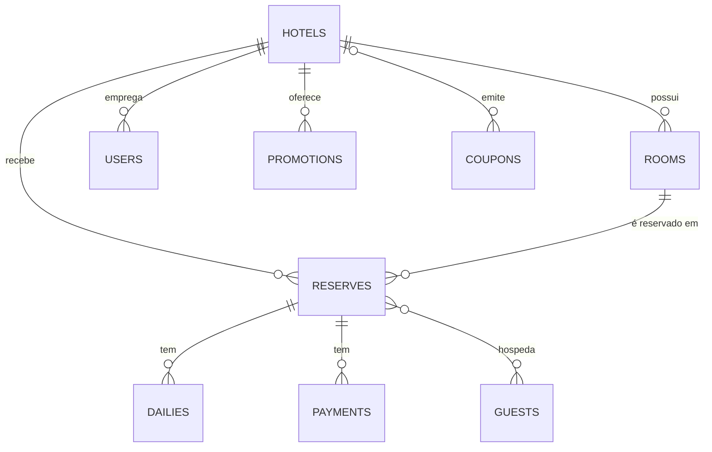

# Foco Hotel API

[](https://github.com/EduardoSL0/desafio-foco-hotel-api/actions/workflows/ci.yml)

API de gestão hoteleira em **Laravel 12**: importa hotéis, quartos e reservas dos XMLs via cron, tem CRUD de
quartos e um motor de reservas com disponibilidade, promoções, cupons, taxas e pagamentos. Respostas em JSON.

## Como rodar

```bash
docker compose up -d --build
```

Abra **http://localhost:8080** (Swagger) e clique em **Entrar** ao lado de um usuário para testar as rotas.

| Usuário | Senha | Acesso |
|---|---|---|
| `admin@foco.test` | `password` | tudo |
| `gerente@foco.test` | `password` | gestão do Hotel Foco Prime |
| `recepcao@foco.test` | `password` | reservas e pagamentos do Hotel Foco Prime |

"Minha reserva" de exemplo: localizador `FH7K3Q9X`, sobrenome `de Tal`.

```bash
docker compose exec app php artisan test        # testes
docker compose exec app php artisan import:xml  # importar os XMLs agora
```

<details>
<summary>Sem Docker</summary>

PHP 8.2+, Composer e MySQL 8:

```bash
composer install && cp .env.example .env && php artisan key:generate
php artisan migrate --seed
php artisan serve          # http://localhost:8000
php artisan schedule:work  # o cron
```

</details>

## Importação e cron

```bash
php artisan import:xml
```

Lê `database/xml`, grava tudo numa transação e pode rodar várias vezes sem duplicar. O agendamento
(de hora em hora, `XML_IMPORT_CRON`) fica em `routes/console.php`; no Docker o container `scheduler` faz o papel
do cron. Em servidor Linux:

```cron
* * * * * cd /caminho/do/projeto && php artisan schedule:run >> /dev/null 2>&1
```

## Modelagem

Migrations em `database/migrations` e o mesmo modelo em [`database/model/schema.sql`](database/model/schema.sql)
(abre no MySQL Workbench via *Reverse Engineer*).



## Cadastrar um quarto

```bash
curl -X POST http://localhost:8080/api/v1/rooms -H "Authorization: Bearer $TOKEN" -H "Content-Type: application/json" \
  -d '{"hotel_id": 1, "name": "Standard Casal", "capacity": 2, "inventory": 10, "daily_price": 189.90}'
```

`inventory` é o número de unidades iguais do quarto. Editar: `PATCH /rooms/{id}`. Remover: `DELETE /rooms/{id}`.

## Criar uma reserva

```bash
curl -X POST http://localhost:8080/api/v1/reserves -H "Content-Type: application/json" \
  -d '{"room_id": 1, "check_in": "2027-03-10", "check_out": "2027-03-13",
       "guests": [{"name": "Maria", "last_name": "Souza", "phone": "5571999990000"}]}'
```

Rota pública. O servidor calcula o total; para só simular, use `POST /reserves/quote`.

## Rotas

Base `http://localhost:8080/api/v1` · 🔒 exige login · detalhes no Swagger.

| Rota | Para quê |
|---|---|
| `/auth/login` · `/auth/me` · `/auth/logout` | autenticação |
| `/hotels` · `/rooms` · `/rooms/{id}/availability` | hotéis e quartos (escrita 🔒) |
| `/availability` · `/reserves/quote` · `/reserves` · `/reserves/lookup` | busca, cotação, reserva e "minha reserva" |
| `/reserves` · `/reserves/{id}/cancel` 🔒 | consultar e cancelar |
| `/reserves/{id}/payments` · `…/payments/{id}/refund` 🔒 | pagamentos e estornos |
| `/coupons` · `/promotions` · `/users` 🔒 | cupons, promoções e equipe |
| `/hotels/{id}/report` 🔒 | ocupação, ADR e RevPAR |

## Regras de negócio

- **Disponibilidade** por unidades do quarto, noite a noite; trava no banco evita vender a última unidade duas vezes.
- **Preço:** diárias → promoção → cupom → taxa de serviço (3 × R$ 100, 20%, 10%, 10% = **R$ 237,60**).
- **Pagamentos:** parcelamento só no crédito, juros acima de 3×; estorno por admin ou gerente.
- **Pré-reserva:** reserva sem login e sem pagamento libera o quarto após 24 h.
- **Permissões:** admin vê tudo; gerente e recepção só o próprio hotel.
- Valores calculados em centavos.

## Decisões sobre os XMLs

- Diárias fora do período da reserva (reserva 6) ou repetidas são ignoradas, com aviso no log.
- `rooms.xml` não tem preço: usa a última diária importada do quarto.
- Pagamento: 1 crédito, 2 débito, 3 pix, 4 dinheiro, 5 boleto.
- Mesmo nome + telefone = mesmo hóspede.

## Qualidade e segurança

- 173 testes (PHPUnit) e CI com Pint e validação do Swagger a cada push.
- Logs em `storage/logs`, ligados pelo `X-Request-Id` de cada resposta.
- Token com validade, limite de requisições, proteção contra XXE, erros sem detalhes internos e consulta pública
  sem dados pessoais dos hóspedes. LGPD: `php artisan guests:anonymize {id}`.

<details>
<summary>Produção</summary>

O `docker-compose.yml` é para avaliação. Em produção: defina `DB_PASSWORD`, `MYSQL_ROOT_PASSWORD` e
`SEED_ON_START=false`, crie o admin com `php artisan user:create-admin email@hotel.com`, configure
`TRUSTED_PROXIES` e `CORS_ALLOWED_ORIGINS` e agende backup do banco (`mysqldump`).

</details>
